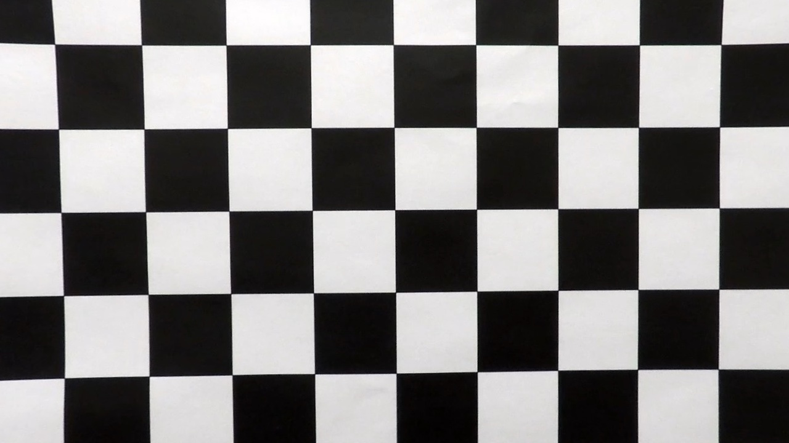
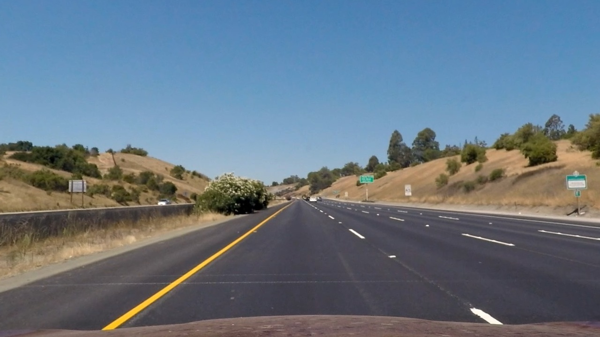
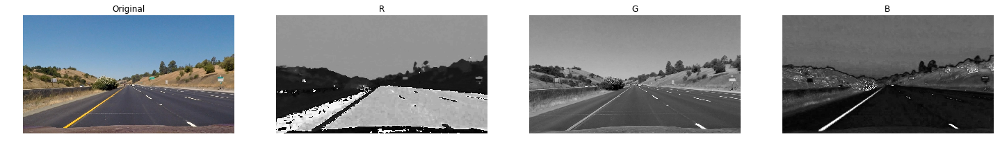
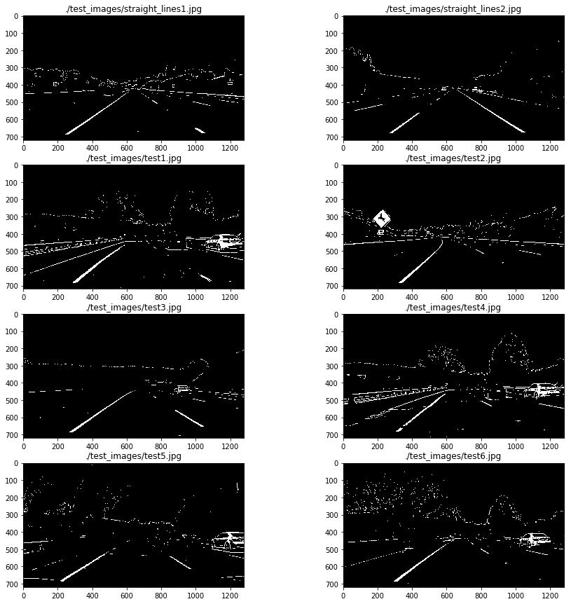
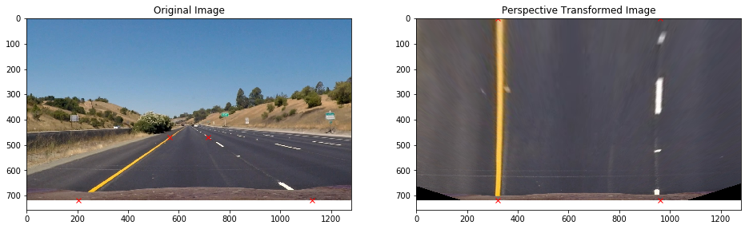
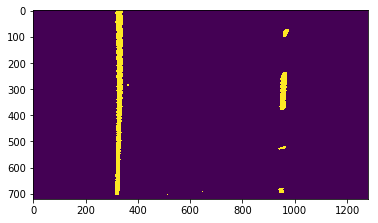
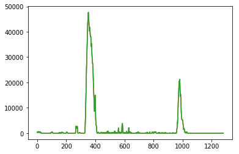
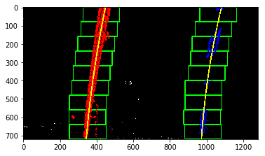
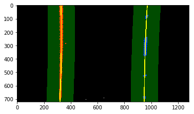
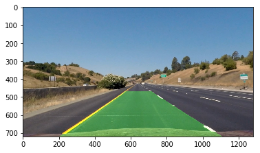

# Advanced Lane Finding for Self-Driving Cars

The goal of this project is to produce a robust pipeline for detecting lane lines given a raw image from a car's dash cam. The pipeline should output a visual display of the lane boundaries, numerical estimation of lane curvature, and vehicle position within the lane.

<!--   -->


## Solution

### Overview

The steps taken to complete this project are as follows:

* Compute the camera calibration matrix and distortion coefficients given a set of chessboard images.
* Apply a distortion correction to raw images.
* Use color transforms and gradients to create a thresholded binary image.
* Apply a perspective transform to rectify binary image ("birds-eye view").
* Detect lane pixels and fit to find the lane boundary.
* Determine the curvature of the lane and vehicle position with respect to center.
* Warp the detected lane boundaries back onto the original image.
* Output visual display of the lane boundaries, numerical estimation of lane curvature, and vehicle position.


### Camera Calibration

The code for this step is contained in the Jupyter notebook `Camera_Calibration.ipynb`.  

The OpenCV functions `findChessboardCorners` and `calibrateCamera` are the backbone of the image calibration. A number of images of a chessboard, taken from different angles with the same camera, comprise the input. Arrays of object points, corresponding to the location (essentially indices) of internal corners of a chessboard, and image points, the pixel locations of the internal chessboard corners determined by `findChessboardCorners`, are fed to `calibrateCamera` which returns camera calibration and distortion coefficients. These can then be used by the OpenCV `undistort` function to undo the effects of distortion on any image produced by the same camera. Generally, these coefficients will not change for a given camera (and lens). The below image depicts the corners drawn onto twenty chessboard images using the OpenCV function `drawChessboardCorners`: Here an original image (left) and an undistorted image (right):

  

### Distortion Correction

Using the camera matrix and distortion coefficients produced in the previous step, I undistort all incoming raw images using the OpenCV `imgUndistort()` function. 

```python
def imgUndistort(img, mtx=mtx, dist=dist):
    """
    Undistort image
    
    Arguments:
        img: source image
        mtx: camera internal matrix
        dist: distortion coefficients
    """
    return cv2.undistort(img, mtx, dist, None, mtx)
```

Here's an example of an original image, and an undistorted version of that image.

  


### Thresholded Binary Images

In order to accurately find the lane lines in an image, I explored several combinations of sobel gradient thresholds and color channel thresholds in multiple color spaces. These are labeled clearly in the Jupyter notebook. 



After appkying many combinations, it was found that none of these were very robust to changing conditions in lighting and contrast. After doing some research on internet, it was found that using a second derivative operation (Laplacian) might be more suited to this purpose. By using a Laplacian filter (using `cv2.Laplacian`) on the image followed by thresholding it to highlight only the negative values, it's possible to reject many of the false positives [ [Ref](http://www.eng.utah.edu/~hamburge/Road_Marking_Features_and_Processing_Steps.pdf) ]. The Laplacian resulted in better results than using combinations of Sobel gradients.

The thresholding operations used to detect edges in the images can be found in `Advance_Lane_Detection.ipynb` in the function called `find_edges`. The thresholded binary mask obtained from the Laplacian is named `mask_one` in the code. The thresholding is first performed on the S-channel of the image in HLS colorspace. If too few pixels were detected by this method (less than 1% of total number of pixels), then the Laplacian thresholding is attempted on the grayscale image.

The second thresholded mask, `mask_two`, is created using a simple threshold on the S-channel. And finally, a brightness mask (`gray_binary`) is used to reject any darker lines in the final result. These masks are combined as:
`combined_mask = gray_binary AND (mask_one OR mask_two)`

The results obtained using the edge detection algorithm for an image is shown below:




### Perspective Transform

After we have the undistorted images, we can perform a perspective transform to get a birds-eye view of the lane lines. This will help us fit polynomials to the lines later. To perform the transform, I used the cv2 `getPerspectiveTransform` and `warpPerspective` functions to first calculate the transform matrix using source and destination points, the applying that transform to a given image. Here is the helper function I wrote that accomplishes that:

```python
def perspective_transform_matrix(self, img, img_size):
    src = np.float32(\
    [[(img_size[0] / 2) - 75, img_size[1] / 2 + 110],\
        [((img_size[0] / 6) - 10), img_size[1]],\
        [(img_size[0] * 5 / 6) + 60, img_size[1]],\
        [(img_size[0] / 2 + 75), img_size[1] / 2 + 110]]) 

    dst = np.float32(\
    [[(img_size[0] / 4), 0],\
        [(img_size[0] / 4), img_size[1]],\
        [(img_size[0] * 3 / 4), img_size[1]],\
        [(img_size[0] * 3 / 4), 0]])

    M = cv2.getPerspectiveTransform(src, dst)
    Minv = cv2.getPerspectiveTransform(dst, src)

    return M, Minv
```

```python
def warpImage(img):
    img_size = img.shape[:2][::-1]
    M, Minv = perspective_transform_matrix(img)
    return cv2.warpPerspective(img, M, img_size)

```

I tuned these source and destination points on straight lane test images. And here's what the output looks like on straight lines (with the points drawn):






### Finding Lane Line Pixels and Fitting

The step where I find the lane lines and fit a polynomial to the lines takes in the warped, binary threshold image. If we don't have any previous fit data, then I first take a histogram of the bottom half of the warped, binary threshold image. This will identify where the most "hot" pixels are and I select a window around these points (+/- 100 px of the maximum). 



There are 9 windows, so each window is 80px tall for these images (720 / 9). For each window, I pull out all the pixels from the binary threshold image that are "on", and add them to the list of indicies. For the next window, I use the average of the current "on" pixels to be the middle of the next window. At the end, I fit a polynomial through all the pixels that were found in the windows and were "on".  Here's an example image from that process:



For a previous fit, the window is the previous fit +/- 100 px so it's a polynomial window. I pull out all the "on" pixels from this window and fit a polynomial through those points.




### Calculating Corner Radius and Lane Center

The radius of curvature is based upon [this website](http://www.intmath.com/applications-differentiation/8-radius-curvature.php) and calculated in the code cell titled "Radius of Curvature and Distance from Lane Center Calculation" using this line of code (altered for clarity):
```
curve_radius = ((1 + (2*fit[0]*y_0*y_meters_per_pixel + fit[1])**2)**1.5) / np.absolute(2*fit[0])
```
In this example, `fit[0]` is the first coefficient (the y-squared coefficient) of the second order polynomial fit, and `fit[1]` is the second (y) coefficient. `y_0` is the y position within the image upon which the curvature calculation is based (the bottom-most y - the position of the car in the image - was chosen). `y_meters_per_pixel` is the factor used for converting from pixels to meters. This conversion was also used to generate a new fit with coefficients in terms of meters. 

```
xm_per_pix = 3.7/700 # meters per pixel in x dimension
ym_per_pix = 30/720 # meters per pixel in y dimension
```

The position of the vehicle with respect to the center of the lane is calculated with the following lines of code:
```
lane_center_position = (r_fit_x_int + l_fit_x_int) /2
center_dist = (car_position - lane_center_position) * x_meters_per_pix
```
`r_fit_x_int` and `l_fit_x_int` are the x-intercepts of the right and left fits, respectively. This requires evaluating the fit at the maximum y value (719, in this case - the bottom of the image) because the minimum y value is actually at the top (otherwise, the constant coefficient of each fit would have sufficed). The car position is the difference between these intercept points and the image midpoint (assuming that the camera is mounted at the center of the vehicle).

```python
def calculate_curvature(binary_warped, line_fit):
    
    ploty = np.linspace(0, binary_warped.shape[0]-1, binary_warped.shape[0] )
    line_fitx = line_fit[0]*ploty**2 + line_fit[1]*ploty + line_fit[2]
    
    y_eval = np.max(ploty)
    
    # Fit new polynomials to x,y in world space
    line_fit_cr = np.polyfit(ploty*ym_per_pix, line_fitx*xm_per_pix, 2)
    
    # Calculate the R_curve (radius of curvature)
    cal_rcurve = ((1 + (2*line_fit_cr[0]*y_eval*ym_per_pix + line_fit_cr[1])**2)**1.5) / np.absolute(2*line_fit_cr[0])
    
    # Calculate line position offset to center
    p_line = np.poly1d(line_fit)
    line_fitx_1 = p_line(y_eval)
    
    center_offset = (line_fitx_1 - binary_warped.shape[1]/2)*xm_per_pix
    
    return cal_rcurve, center_offset
```

### Warp Detected Lane Boundaries onto Original Image

After detecting the lane lines, calculating the radius of curvature, and finding the vehicles position within the lane, I unwarp the image back to the original perspective using the OpenCV `warpPerspective()` function as before, but this time using the inverse matrix. 



### Visual Display of the Lane Boundaries, Curvature, and Vehicle Position


### Final Pipeline

Now, it's time to combine all pieces and make it work for video. Pipeline is implemented in `Pipeline.ipynb`.


### Discussion

My pipeline works well on the project video, but I haven't yet extended it to prove effective on the challenge videos. One reason is due to the lane shift seen in the challenge video, along with the different color blacktop in the lane due to construction. A fix for that could be to check the distance between the two detected lane lines. Filtering out lines if they are not the correct distance apart, about 3.7 meters, will filter out other lines like those in the challenge video. Another reason my algorithm currently fails on the harder challenge video is I am currently averaging the lines over 15 frames to smooth the output of the line boundaries. This produces a nice output for the project video, but fails when faced with consecutive sharp turns. I could also experiment with other checks such as determining that the detected left and right lane lines are relatively parallel to be sure the lines are in fact the lane lines. I plan to experiment with these ideas and make my algorithm robust enough to complete the challenge videos in the coming days.
